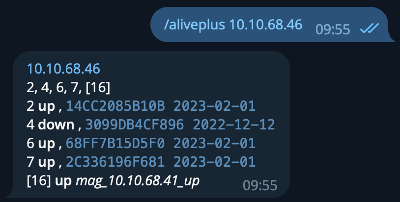
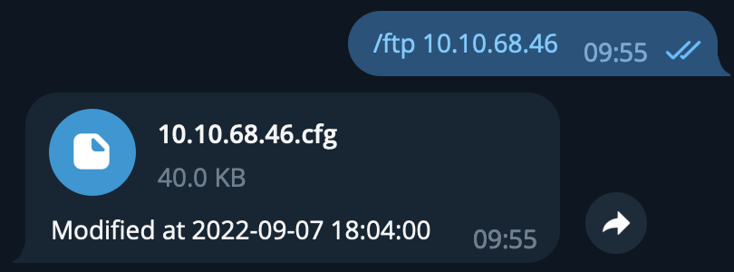
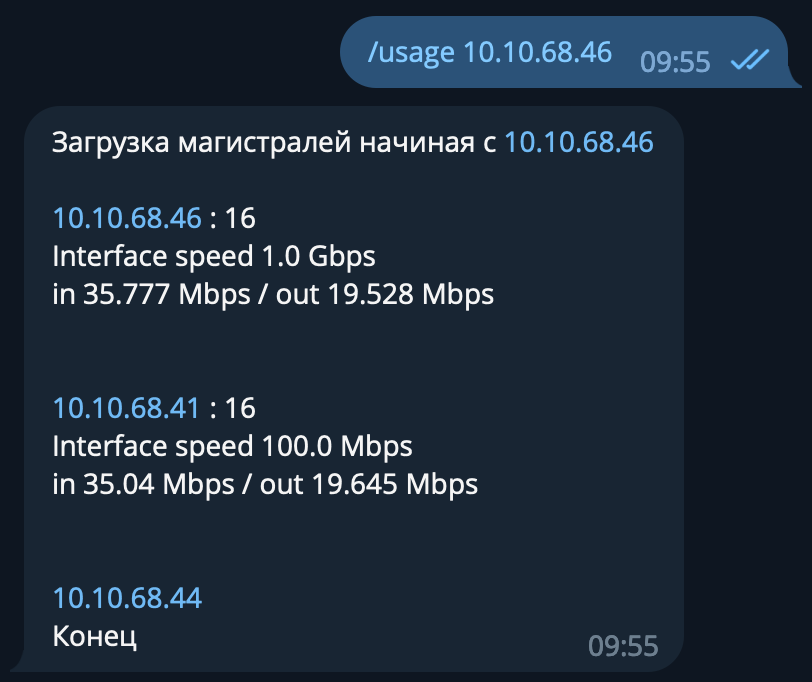

What bot can do
-------------
Three and half shiny commands

    /alive 10.10.68.46
Show ports, on which at least one MAC address was detected in last 6 months OR which are up


    /aliveplus 10.10.68.46

Same as above, but more verbose, with aliases, exact MAC and last seen time, and port operational status


    /ftp 10.10.68.46

Send last configuration backup and last backup time


    /usage 10.10.68.46

Show uplink port utilization on target switch, and on uplink switch, and so on as far as we can determine uplink switch


Installation
------------
1. Upgrade pip and setuptools

```pip install -U setuptools pip```

2. install bot

```pip install .```

Usage
------------
Only one entry point provided:

```
stp_bot
```

All parameters could be provided via environmental variables or via commandline parameters

Parameter list is available with ``--help`` option

```
$ stp_bot --help
usage: stp_bot [-h] --token TOKEN [--allowed-chats ALLOWED_CHATS] --ftp-host FTP_HOST --ftp-username FTP_USERNAME --ftp-password FTP_PASSWORD --ftp-folder FTP_FOLDER
               --userside-url USERSIDE_URL --userside-key USERSIDE_KEY --zabbix-url ZABBIX_URL --zabbix-username ZABBIX_USERNAME --zabbix-password ZABBIX_PASSWORD

options:
  -h, --help            show this help message and exit

Bot:
  --token TOKEN, -t TOKEN
                        Bot token [env var: STPBOT_TOKEN] (default: None)
  --allowed-chats ALLOWED_CHATS
                        If specified: only messages from specified chat participants will be processed. Comma-separated [env var: STPBOT_ALLOWED_CHATS] (default: None)

FTP:
  --ftp-host FTP_HOST   FTP host [env var: STPBOT_FTP_HOST] (default: None)
  --ftp-username FTP_USERNAME
                        FTP username [env var: STPBOT_FTP_USERNAME] (default: None)
  --ftp-password FTP_PASSWORD
                        FTP password [env var: STPBOT_FTP_PASSWORD] (default: None)
  --ftp-folder FTP_FOLDER
                        FTP folder [env var: STPBOT_FTP_FOLDER] (default: None)

Userside:
  --userside-url USERSIDE_URL
                        Userside API URL (including api.php) [env var: STPBOT_USERSIDE_URL] (default: None)
  --userside-key USERSIDE_KEY
                        Userside API key [env var: STPBOT_USERSIDE_KEY] (default: None)

Zabbix:
  --zabbix-url ZABBIX_URL
                        Zabbix API URL (including api_jsonrpc.php) [env var: STPBOT_ZABBIX_URL] (default: None)
  --zabbix-username ZABBIX_USERNAME
                        Zabbix API username [env var: STPBOT_ZABBIX_USERNAME] (default: None)
  --zabbix-password ZABBIX_PASSWORD
                        Zabbix API password [env var: STPBOT_ZABBIX_PASSWORD] (default: None)

 If an arg is specified in more than one place, then commandline values override environment variables which override defaults.

```
